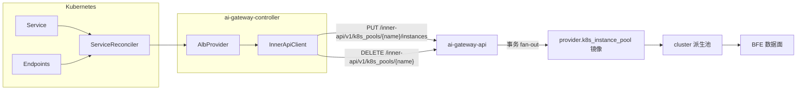
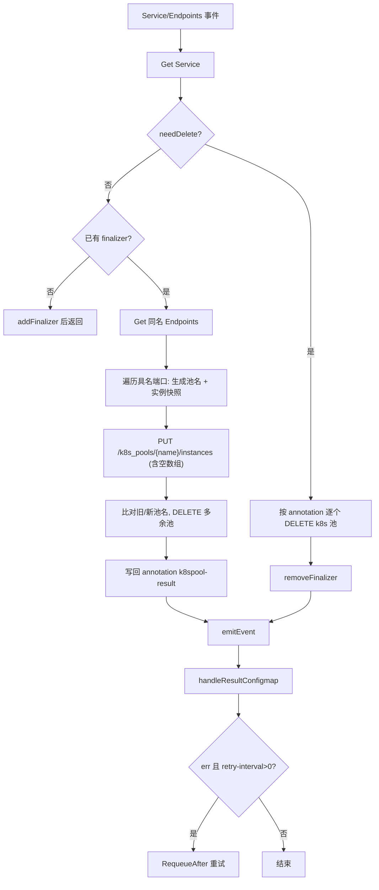

# ai-gateway-controller 支持 K8s Pool：Service 发现设计文档

本文档描述 ai-gateway-controller 配合 ai-gateway-api 的 k8s provider 实例池变更，将 Service 发现的写入通道从 **product_pool（OpenAPI）** 切换为 **k8s_pools（InnerAPI）** 的设计。变更日期：2026-10-08。

- 改造入口：`internal/controllers/loadbalancer/service_controller.go`
- 上游契约（ai-gateway-api 仓库）：`api-define/InnerAPI接口定义/k8s-pools.md`、`api-define/OpenAPI接口定义/providers.md`
- 依赖接口快照（本仓库）：`design-docs/depends-api/innerapi/k8s_pools.go`（从 ai-gateway-api `endpoints/innerapi_v1/k8s_pools` 拷贝）
- 参考子系统设计：`design-docs/sys-design/service-discovery-design.md`、`design-docs/sys-design/overview.md`
- 输入契约：`design-docs/api-define/service-yaml-api-define.md`
- 可运行示例：`examples/l7service/`（`prerequisite.yaml` / `whoami_airs.yaml` / `whoami_airs_empty.yaml`）

> 范围声明：本次改造仅涉及 ServiceReconciler（普通 Service 发现）。controller 的 InferencePool 发现链路（`inferencepool_reconciler.go` / Pod 同步 / product_pool 客户端）已随后整体移除，本仓库只保留「Service 发现 → k8s_pools」一条链路。

---

## 1. 背景与目标

### 1.1 现状

ServiceReconciler 监听 `Service` 与同名 `Endpoints`，为每个具名端口向 ALB 的 **产品实例池** 写入后端实例，写入链路为 OpenAPI 产品池序列（`internal/alb/albProvider.go`）：

1. `GetProductPool(product, pool)` → 判断是否存在；
2. 不存在则 `CreateProductPool`，存在则 `UpdateProductPool`（`PATCH /open-api/v1/products/{product}/instance-pools/{name}`）；
3. Service 删除或端口移除时 `DeleteProductPoolByList`；
4. 池列表记录在 Service annotation `k8s.bfenetworks.com/productpool-result`（元素为 `{Product, Poolname}`）。

该链路把"实例成员"和"产品池定义"耦合在一起：控制器既决定池名，也直接写产品池成员。

### 1.2 引入 k8s_pools 后的变化

ai-gateway-api 新增了 `instance_source` / `k8s_pool_name` / `k8s_instance_pool` 三字段与 `/k8s_pools` InnerAPI。语义变为：

- Provider 由**人**创建并声明实例来源（`instance_source=k8s_pool` + `k8s_pool_name`）；
- **K8s 实例池成员的唯一写入方是发现组件**（本控制器），经 InnerAPI `PUT /inner-api/v1/k8s_pools/{name}/instances` 全量替换；
- Provider 上的 `k8s_instance_pool` 是系统维护的只读镜像，由 ai-gateway-api 在同一个事务里 fan-out 刷新，并联动引用该 Provider 的 cluster 派生池；
- "创建归人、成员归发现"，控制器不再直接触碰 BFE 产品池。

### 1.3 目标

| 目标 | 说明 |
| --- | --- |
| 写入通道切换 | Service 发现改为向 `/inner-api/v1/k8s_pools/{name}/instances` 全量上报实例快照，删除改为 `DELETE /inner-api/v1/k8s_pools/{name}` |
| 职责收敛 | 控制器只负责"Service/Endpoints → 池名 + 实例快照"的发现，不再负责产品池 CRUD 与产品维度寻址 |
| 空池正确表达 | Endpoints 无 Ready 地址时上报空数组（零实例），修复旧逻辑"跳过写空导致残留实例"的问题 |
| 幂等与可重试 | PUT 为幂等 upsert、DELETE 对 404 视为成功，天然适配 reconcile 重试 |
| 最小改动面 | 仅改 Service 发现链路；InferencePool 发现链路与 product_pool 客户端已一并移除 |

---

## 2. 目标架构



与旧链路的对比：

| 维度 | 旧（product_pool 序列） | 新（k8s_pools） |
| --- | --- | --- |
| 写接口 | `GET` + `POST/PATCH /open-api/v1/products/{product}/instance-pools[/{name}]` | `PUT /inner-api/v1/k8s_pools/{name}/instances` |
| 删接口 | `DELETE /open-api/v1/products/{product}/instance-pools/{name}` | `DELETE /inner-api/v1/k8s_pools/{name}` |
| 池寻址 | `(product, poolname)` 二元组 | `poolname` 一元（池与产品解耦） |
| 成员语义 | 产品池成员即最终后端 | 控制面池成员，经 provider 镜像 → cluster 派生池 → 导出 |
| 空实例 | 跳过写，旧实例残留 | 上报 `[]`，明确零实例 |
| 单池调用次数 | 2（GET 判存在 + 写） | 1（幂等 PUT） |
| 幂等性 | Create/Update 分支，需先探存 | PUT 幂等 upsert，可任意重试 |

---

## 3. 接口对接设计

### 3.1 InnerAPI 端点（摘录）

| 端点 | Method | 用途（控制器） |
| --- | --- | --- |
| `/inner-api/v1/k8s_pools/{name}/instances` | PUT | **主写入路径**：全量替换某池实例快照（不存在则创建） |
| `/inner-api/v1/k8s_pools/{name}` | DELETE | Service 删除 / 端口移除时删除池（无引用保护，404 幂等） |
| `/inner-api/v1/k8s_pools/{name}` | GET | 可选：同步状态查询/诊断（`instance_count`、`last_sync_time`） |
| `/inner-api/v1/k8s_pools` | GET | 可选：全量池列表（诊断/对账） |

关键契约（详见 ai-gateway-api 仓库 `api-define/InnerAPI接口定义/k8s-pools.md`，本地快照 `design-docs/depends-api/innerapi/k8s_pools.go`）：

- PUT body 为**裸 JSON 数组**：`[{"addr": "...", "port": 8000, "weight": 100}, ...]`；空数组合法（零实例）；同池内 `(addr, port)` 不能重复。
- PUT 返回更新后的池条目：`{name, instances, instance_count, last_sync_time}`。
- DELETE 无引用保护；池不存在返回 404。被 provider 引用时，api 侧会清空引用者镜像并联动 cluster 派生池（单事务）。
- 鉴权：router 级 `McUserProbe` + 端点级 feature/action（`k8s_pools` 域，PUT=Update、DELETE=Delete、GET=Read）。

### 3.2 客户端设计（`internal/alb`）

为 k8s_pools 单独引入 `InnerApiClient`（`internal/alb/innerApiClient.go`）：与 `AlbProvider` 共用 `ApiServerAddr` / Token / Timeout，封装 `/inner-api/v1` 的路径、一元寻址与幂等约定，并通过 `K8sPoolClient` 接口便于注入 fake 做单测。

#### 3.2.1 结构（新增 `internal/alb/innerApiClient.go`）

客户端结构与命名：

```go
const (
    innerAPIVersion      = "/inner-api/v1"
    k8sPoolPath          = innerAPIVersion + "/k8s_pools/%s"
    k8sPoolInstancesPath = k8sPoolPath + "/instances"
)

type InnerApiClient struct {
    remote string
    token  string
    client *http.Client
}

func NewInnerApiClient(addr, token string, timeout int) *InnerApiClient {
    return &InnerApiClient{
        remote: addr,
        token:  token,
        client: &http.Client{Timeout: time.Duration(timeout) * time.Millisecond},
    }
}
```

#### 3.2.2 对外方法

```go
// PUT /inner-api/v1/k8s_pools/{name}/instances —— 全量替换（幂等 upsert）
// body 为裸 JSON 数组；instances 为空切片时序列化为 []（零实例）
func (c *InnerApiClient) ReplaceK8sPoolInstances(ctx context.Context, name string,
    instances []*k8s_pool.Instance) (*k8s_pool.PoolEntry, int, error)

// DELETE /inner-api/v1/k8s_pools/{name} —— 404 视为成功（期望态删除）
func (c *InnerApiClient) DeleteK8sPool(ctx context.Context, name string) error

// 可选：读取/诊断
func (c *InnerApiClient) GetK8sPool(ctx context.Context, name string) (*k8s_pool.PoolEntry, int, error)
func (c *InnerApiClient) ListK8sPools(ctx context.Context) ([]*k8s_pool.PoolListEntry, int, error)
```

#### 3.2.3 低层请求

保留独立的 `doReq` / `doReqImpl`：`Result` 信封解析、`Authorization: <token>` 头、body 为 `nil` 时不设置 `Content-Type`（DELETE 走空 body）。

```go
func (c *InnerApiClient) doReq(ctx context.Context, uri, method string, obj interface{}) (*apis.Result, error)
func (c *InnerApiClient) doReqImpl(ctx context.Context, url, method string, obj interface{}) (*apis.Result, bool, error)
```

实现要点：

1. 复用 `internal/alb/apis/result.go` 的 `apis.Result{ErrNum, RetMsg, Data}` 信封，无需新信封类型；
2. `ctx` 透传（`http.NewRequestWithContext`），便于超时/取消；
3. `instances` 为 `nil` 时规范化为空切片，保证请求体始终是裸数组 `[]`。

#### 3.2.4 错误与幂等约定

- 非 200 → `fmt.Errorf("code:%d, error:%s", result.ErrNum, result.RetMsg)`；由 Reconcile 按重试间隔重试。
- `DeleteK8sPool`：`ErrNum==404`（或响应含 "not exist"）→ 返回 `nil`（幂等删除）。
- `ReplaceK8sPoolInstances`：把 `Data` 解析为 `PoolEntry`，返回 `instance_count` / `last_sync_time` 供日志打点。
- Token 由 `--ai-gateway-api-token` 提供，需具备 `k8s_pools` 域 Update/Delete（以及可选 Read）权限，否则返回 402。

#### 3.2.5 接口抽象（依赖注入与测试）

```go
// K8sPoolClient 抽象 InnerApiClient 的 K8s 池方法，供 AlbProvider 依赖注入与单测打桩。
type K8sPoolClient interface {
    ReplaceK8sPoolInstances(ctx context.Context, name string, instances []*k8s_pool.Instance) (*k8s_pool.PoolEntry, int, error)
    DeleteK8sPool(ctx context.Context, name string) error
    GetK8sPool(ctx context.Context, name string) (*k8s_pool.PoolEntry, int, error)
    ListK8sPools(ctx context.Context) ([]*k8s_pool.PoolListEntry, int, error)
}
```

- `AlbProvider` 新增字段 `innerClient K8sPoolClient`，由 `NewAlbProvider` 用 `NewInnerApiClient(opts.ApiServerAddr, opts.Token, opts.Timeout)` 装配；`ExternalLB` 类型不变，ServiceReconciler 调用面不变。
- 单测注入 fake `K8sPoolClient` 覆盖 AlbProvider/Reconciler 逻辑；`InnerApiClient` 自身另用 `httptest.Server` 断言 method/path/body 与 404 幂等。

#### 3.2.6 接口数据结构包（新增 `internal/alb/apis/k8s_pool/`）

镜像 ai-gateway-api 的 `PoolEntry`/`PoolListEntry`，字段对齐 `k8s_pools.go`：

```go
type Instance struct {
    Addr   string `json:"addr"`
    Port   int    `json:"port"`
    Weight int64  `json:"weight,omitempty"` // 缺省由 API 置 100
}

type PoolEntry struct {
    Name          string      `json:"name"`
    Instances     []*Instance `json:"instances"`
    InstanceCount int         `json:"instance_count"`
    LastSyncTime  int64       `json:"last_sync_time"`
}

type PoolListEntry struct {
    Name          string `json:"name"`
    InstanceCount int    `json:"instance_count"`
    LastSyncTime  int64  `json:"last_sync_time"`
}
```

约定：`instances` 直接作为请求体序列化（裸数组）；空切片序列化为 `[]`，与"零实例"语义一致。

### 3.3 实例映射

沿用实例提取规则（现为 `getK8sPoolInstances`，`internal/alb/albProvider.go:65`），仅调整目标结构：

| 旧字段（`product_pool.Instance`） | 新字段（`k8s_pool.Instance`） |
| --- | --- |
| `IP: addr.IP` | `Addr: addr.IP` |
| `Ports: {"Default": int(p.Port)}` | `Port: int(p.Port)` |
| `Weight: 1` | 不显式设置（API 默认 `100`）或显式 `100` |
| `Hostname: addr.IP` | —（K8s 池无 hostname） |
| 仅取 `subset.addresses`（Ready） | 不变 |

要点：

- 仅使用 `subset.addresses`（Ready 地址），忽略 `notReadyAddresses`；
- 端口取与 Service `spec.ports[].name` 同名的 `subset.ports[].port`（targetPort 实际端口）；
- 池内对 `(addr, port)` 做去重，避免命中 API 的 422；
- 权重采用 API 默认值 `100`（与 `k8s-pools.md` "发现实例默认 weight=100" 一致），控制器侧不参与权重策略。

---

## 4. 池命名规则

Provider 的 `k8s_pool_name` 由人填写，Service→池名映射由发现组件约定，两者必须完全一致。控制器保证同一 Service/端口生成确定的池名：

```
k8s_<namespace>_<service-name>_<port-name>[_<cluster-name>]
```

- `<cluster-name>`：`--k8s-cluster-name`（默认 `testk8s`），为空时不追加；
- `<port-name>`：`spec.ports[].name`，空名端口跳过；
- 示例（取自 `examples/l7service/whoami_airs.yaml`，`--k8s-cluster-name=szyf`）：`k8s_rainway-ai-gatway_whoami-airs_http0_szyf`、`k8s_rainway-ai-gatway_whoami-airs_http1_szyf`。

### 4.1 命名合法性与长度约束

`k8s_pools.name` 校验（`iprovider.K8sPoolName`）：长度 1–64；仅允许字母、数字、`_`、`-`、`.`；不能以 `.`、`-`、`_` 开头或结尾；不能含空白。K8s 的 namespace/service/port 均为 RFC1123（小写字母数字与 `-`），天然合法；`<cluster-name>` 为控制器自管标识，需保证合法。

当拼接结果超过 64 字符时（长命名空间/服务名/端口名场景），采用"可读前缀 + 短哈希"折叠，保证确定性与低碰撞：

```
identity = "<ns>|<svc>|<port>|<cluster>" // 身份串，用于哈希
name     = "<prefix>"                    // 原始拼接结果
if len(name) > 64 {
    name = name[:55] + "_" + shortHash8(identity) // 55+1+8 = 64，结尾为十六进制字母数字
}
```

- `shortHash8` 取身份串（`ns|svc|port|cluster`）的 sha256 哈希前 8 位十六进制；
- 因折叠会截断可读前缀，控制器在生成时对超长情况记录日志（含原始身份），便于运维反查；
- 生成失败（如 `<cluster-name>` 含非法字符）时，Reconcile 返回错误（在 `--retry-interval-unit-sec>0` 时按该间隔重试），同时写结果 ConfigMap，不静默丢弃。

---

## 5. ServiceReconciler 改造

### 5.1 主流程



### 5.2 写入（`ensurePool` → `ensureK8sPool`）

`ensurePool`（`service_controller.go:137`）保留"读同名 Endpoints"的前置逻辑，`ensureProductPool` 改为 `ensureK8sPool`（`service_controller.go:152`）。整体结构对齐旧实现（同步池 → 与旧 annotation 差集删除多余池 → 写回），只把底层调用换成 k8s_pools：

```go
func (r *ServiceReconciler) ensureK8sPool(ctx context.Context, service *corev1.Service,
    ep *corev1.Endpoints) error {

    // 逐端口 PUT 全量快照（含空数组），返回成功上报的池名
    poolNames, err1 := r.ExternalLB.EnsureK8sPool(ctx, service, ep, option.Opts.ClusterName)

    // 与旧 annotation 差集，DELETE 多余池（端口改名/删除场景）
    annotation := service.Annotations[K8sPoolResultAnnotationKey]
    if annotation != "" {
        oldpools, err := extractPoolNames(annotation)
        if err == nil {
            diff := diffPoolNames(oldpools, poolNames)
            // 仅在本次上报成功时删除多余池；未删成功的池保留在 diff 中
            if err1 == nil {
                delnames, err := r.ExternalLB.DeleteK8sPoolByList(ctx, diff)
                if err != nil {
                    util.HdlLogger.Error(err, "del diff k8s pools")
                }
                diff = diffPoolNames(diff, delnames)
            }
            poolNames = append(poolNames, diff...)
        }
    }

    // 写回最终池名列表（JSON 字符串数组）
    r.addAnnotationByPoolNames(ctx, service, poolNames, K8sPoolResultAnnotationKey)
    return err1
}
```

`AlbProvider` 持有 `innerClient`（k8s_pools 通道），新增方法内部委托它：

```go
type AlbProvider struct {
    options     *externalLB.Options
    innerClient K8sPoolClient    // k8s_pools：Service 发现使用
}

func (p *AlbProvider) EnsureK8sPool(ctx context.Context, service *v1.Service,
    ep *v1.Endpoints, clusterName string) ([]string, error)

func (p *AlbProvider) DeleteK8sPoolByList(ctx context.Context, poolNames []string) ([]string, error)
```

- `EnsureK8sPool`：遍历具名端口 → 生成池名与实例快照 → 逐池调 `innerClient.ReplaceK8sPoolInstances`；
- `DeleteK8sPoolByList`：逐池调 `innerClient.DeleteK8sPool`（404 视为成功），返回删除成功的池名列表；
- `NewAlbProvider` 装配 `NewInnerApiClient(...)`。

差异点：

1. **一次 PUT 代替 GET+写**：取消"先探存再 Create/Update"，直接幂等 upsert；
2. **空实例也上报**：`len(instances)==0` 时仍发 `PUT []` 表达零实例，且保留池名进 annotation。修复旧逻辑"实例为空则跳过写入"导致的实例残留；
3. **按池名一元寻址**：函数不再接收 `product` 参数，池名由 `namespace/service/port/cluster` 生成。

### 5.3 结果 annotation

- 新键：`k8s.bfenetworks.com/k8spool-result`，值为 k8s 池名数组：`["<pool1>", "<pool2>"]`。
- 原因：k8s_pools 以池名一元寻址，`{Product, Poolname}` 结构不再需要；且与旧 annotation 的 JSON 结构显式区分，避免新旧格式混淆。`ProductPoolnameList` / `extractPoolList` / `diffList` / `genProductPoolNameList` 简化为 `[]string` 的序列化、反序列化与集合差集。
- 用途不变：Service 端口改名/删除时，用旧列表与新列表的差集调用 `DeleteK8sPoolByList` 清理多余池；同时把尚未删除成功的池保留在列表中，供下次重试。

### 5.4 删除（`deletePool`）

`deletePool` 读取 `k8spool-result` 的池名列表，逐个 `DELETE /inner-api/v1/k8s_pools/{name}`：

- 404 视为成功（池可能不存在或已被清理）；
- 全部成功（或 `--force-rm-finalizer=true`）后移除 finalizer；
- finalizer `k8s.bfenetworks.com/delete-protection` 保证 Service 删除前完成池清理。

### 5.5 错误处理与重试

- PUT 幂等、DELETE 幂等（404=成功），Reconcile 可安全重试；
- 任一端口 PUT/DELETE 失败即返回错误，由 Reconcile 末尾按 `--retry-interval-unit-sec` 延迟重试；该 flag 默认 `-1`（不重试），仅当 `> 0` 时才返回 `RequeueAfter`；
- 多端口部分失败时，已成功池名写入 annotation，失败池在重试时重新处理，不丢失也不重复。

---

## 6. 配置与权限

| 配置 | 变更 | 说明 |
| --- | --- | --- |
| `--ai-gateway-api-addr` | 不变 | API Server 地址（InnerAPI `/inner-api/v1`） |
| `--ai-gateway-api-token` | 语义扩展 | Token 需具备 `k8s_pools` 域 Update/Delete（可选 Read）权限，否则 PUT/DELETE 返回 402 |
| `--ai-gateway-api-name` | 变更 | 被发现的 Service 需携带同名标签且值一致；`*` 匹配任意，替代原 `--bfe-product-name` |
| `--k8s-cluster-name` | 不变 | 参与池名生成 |

Provider 侧（由人配置，控制器不写），池名须与 §4 生成结果一致。以 `examples/l7service/whoami_airs.yaml`（`--namespace=rainway-ai-gatway`、`--ai-gateway-api-name=rainway-ai-gatway-demo`、`--k8s-cluster-name=szyf`）为例：

```json
{
  "name": "whoami-airs-provider",
  "instance_source": "k8s_pool",
  "k8s_pool_name": "k8s_rainway-ai-gatway_whoami-airs_http0_szyf"
}
```

Provider 可先于池存在创建（池不存在 ≡ 零实例）；池创建后由 `/k8s_pools` 事务自动填充其 `k8s_instance_pool` 镜像。示例部署参数见 `examples/deploy/yf-ai-gateway-controller.yaml`。

---

## 7. 迁移与兼容

写入通道与 annotation 结构均发生变化，升级时存量 Service 的旧产品池不会被新通道清理，需明确迁移策略：

1. **切换 annotation 键**：新代码只读写 `k8spool-result`；旧 `productpool-result` 保留但不再消费。
2. **旧产品池清理**：升级前按存量 Service 的 `k8s.bfenetworks.com/productpool-result` annotation 中的池列表，在 BFE/产品侧一次性统一删除后升级控制器（product_pool 客户端已随 InferencePool 链路移除，控制器不再负责清理旧产品池）。
3. **Provider 配置切换**：为需要接管的 Service 创建 `instance_source=k8s_pool` 的 provider 并填写正确的 `k8s_pool_name`；旧的 `instance_pool` 模式 provider 不受影响（其成员仍由人维护）。
4. **回滚**：本改造不改变 Service 监听选择器与 finalizer；回滚到旧版本后旧代码按旧 annotation 重新接管，新 annotation 被忽略。

---

## 8. 边界与错误处理

| 场景 | 行为 |
| --- | --- |
| Service 无 Ready Pod（Endpoints 无 `addresses`） | 按端口上报 `[]`（零实例），池存在但成员为空；不跳过 |
| `spec.ports[].name` 为空 | 跳过该端口，不生成池（沿用旧行为） |
| 池名超 64 字符 | 折叠为"前缀 + 短哈希"，日志记录原始身份（§4.1） |
| 池名含非法字符/首尾非法 | 生成阶段报错，Reconcile 重试并写结果 ConfigMap |
| PUT 返回 422（重复 addr/port 等） | 控制器侧先去重；仍 422 视为错误并重试，日志含池名与 body |
| DELETE 返回 404 | 视为成功（期望态删除） |
| Token 权限不足（402）/鉴权失败（401） | 返回错误并按间隔重试 |
| 多端口部分成功 | 成功的池名入 annotation，失败池重试时重新处理 |
| Service 端口改名 | 新旧池名差集，旧池被 DELETE，新池被 PUT |
| Service 删除 | finalizer 拦截 → 逐池 DELETE → 移除 finalizer |
| Service 与 Provider 创建顺序 | 任意顺序均可；provider 先建则镜像为空直至首次 PUT |

---

## 9. 可观测性

- **日志**（沿用 `internal/util` logger）：每次 PUT/DELETE 记录池名、实例数；空实例、超长折叠、去重命中显式打点，便于定位"K8s 里有实例但流量没到"。
- **事件（EventRecorder）**：`emitEvent` 语义不变，成功 `Normal`、失败 `Warning`，reason 形如 `update success For <ns>::<name>`。
- **结果 ConfigMap**：`<service-name>.result` 的 `result`/`timestamp` 语义不变，可直接反映新通道的成功/失败。
- **可选对账**：诊断时可调用 `GET /inner-api/v1/k8s_pools/{name}`，用 `instance_count` / `last_sync_time` 检查同步新鲜度。
- **指标**：不新增自定义指标，沿用 controller-runtime 既有 reconcile 指标。

---

## 10. 代码改动清单

| 文件 | 改动点 |
| --- | --- |
| `internal/alb/apis/k8s_pool/`（新增） | InnerAPI 请求/响应结构：`Instance`、`PoolEntry`、`PoolListEntry` |
| `internal/alb/innerApiClient.go`（新增） | `InnerApiClient` 结构与构造函数、`innerAPIVersion`/k8s_pools 路径常量、`K8sPoolClient` 接口、`ReplaceK8sPoolInstances` / `DeleteK8sPool`（可选 `GetK8sPool` / `ListK8sPools`）与独立 `doReq`/`doReqImpl` |
| `internal/alb/albProvider.go` | `innerClient K8sPoolClient` 字段并在 `NewAlbProvider` 装配；`EnsureK8sPool` / `DeleteK8sPoolByList`（委托 innerClient）；`getK8sPoolInstances`；`k8sPoolName`（含折叠与校验） |
| `internal/alb/openApiClient.go`、`internal/alb/apis/product_pool/` | **已删除**（随 InferencePool 链路移除） |
| `internal/controllers/loadbalancer/inferencepool_reconciler.go`、`pod_reconciler.go`、`internal/datastore/`、`internal/datalayer/`、`internal/poolutil/` | **已删除**（InferencePool 发现链路整体移除） |
| `internal/controllers/loadbalancer/service_controller.go` | `ensureProductPool`→`ensureK8sPool`、`deletePool` 改走 k8s_pools；annotation 键与结构改为池名数组；diff 逻辑简化 |
| `internal/controllers/start.go`、`internal/option/options.go`、`cmd/ai-gateway-controller/` | 移除 InferencePool/Pod 控制器装配、`--enable-inference-pool` 开关与 scheme 注册 |
| `design-docs/sys-design/overview.md`、`design-docs/sys-design/service-discovery-design.md` | 已同步更新：新写入通道、池命名、InnerAPI 端点、行号与常量名 |
| `design-docs/api-define/service-yaml-api-define.md` | 已同步更新：Service 输入契约与 `examples/l7service/` 示例对齐 |

---

## 11. 测试

| 层级 | 用例 |
| --- | --- |
| 单元（innerApiClient） | 用 `httptest.Server` 断言 PUT/DELETE 的 method/path/body、裸数组（含 `[]`）、DELETE 404 幂等、非 200 错误码透传 |
| 单元（albProvider） | 池名生成（含超长折叠、非法字符）、实例提取（Ready-only、去重、空列表）；注入 fake `K8sPoolClient` 断言逐池调用与空池上报 |
| 单元（service_controller） | 多端口 PUT、端口改名差集删除、Endpoints 变空上报 `[]`、annotation 写回、删除流程与 finalizer |
| 集成/端到端 | 建 Service（带 `ai-gateway-api-name`）→ 控制器 PUT 池 → api 侧建 `k8s_pool` provider 引用 → provider 镜像出现 → cluster 派生池含实例 → 扩缩容跟随 → 删 Service → 池删除、镜像清空、派生池清空 |
| 回归 | filter 用例（NamespaceFilter / LabelFilter）不受影响 |

mock 分两层：`AlbProvider` / `ServiceReconciler` 注入 fake `K8sPoolClient`；`InnerApiClient` 自身用 `httptest.Server` 校验真实请求（method/path/body/错误码）。

---

## 12. 风险与缓解

| 风险 | 影响 | 缓解 |
| --- | --- | --- |
| Token 缺少 `k8s_pools` 权限 | Service 发现全部 402，实例不上报 | 部署前校验 token 授权；启动期文档明确所需 feature/action |
| 池名折叠后不可读、运维难对应 Service | 排查与 provider 配置困难 | 折叠时日志记录原始身份；文档给出命名公式与示例 |
| 存量旧产品池残留 | BFE 侧存在无人维护的旧池 | 采用 §7 一次性清理（推荐运维清理，或开关自动清理） |
| Provider 未按约定配置 `k8s_pool_name` | 池有实例但 provider 镜像为空，流量不通 | 文档化命名规则；`GET /k8s_pools` 提供 `instance_count`/`last_sync_time` 作为排查抓手 |
| 控制器与 api 版本不匹配（api 未支持 k8s_pools） | PUT 404/405，Service 发现失效 | 升级顺序：先升级 ai-gateway-api，再升级 controller；回滚见 §7.4 |
| 空池下发后该 cluster 请求 500 | 实例未就绪或全部摘除期间流量失败 | 属 K8s 场景固有状态，由"池引用但镜像持续为空"告警覆盖（见 api 侧设计文档） |

---

## 13. 关联文档

- ai-gateway-api 仓库 `api-define/InnerAPI接口定义/k8s-pools.md`：InnerAPI 契约
- ai-gateway-api 仓库 `api-define/OpenAPI接口定义/providers.md`：`instance_source` / `k8s_pool_name` / `k8s_instance_pool`
- `design-docs/depends-api/innerapi/k8s_pools.go`：依赖接口快照（InnerAPI 端点）
- `design-docs/sys-design/overview.md`：总体设计
- `design-docs/sys-design/service-discovery-design.md`：Service 发现子系统设计
- `design-docs/api-define/service-yaml-api-define.md`：Service 输入契约与示例
- `examples/l7service/`：可运行示例（Namespace / Deployment / 双端口 Service / 空池 Service）
