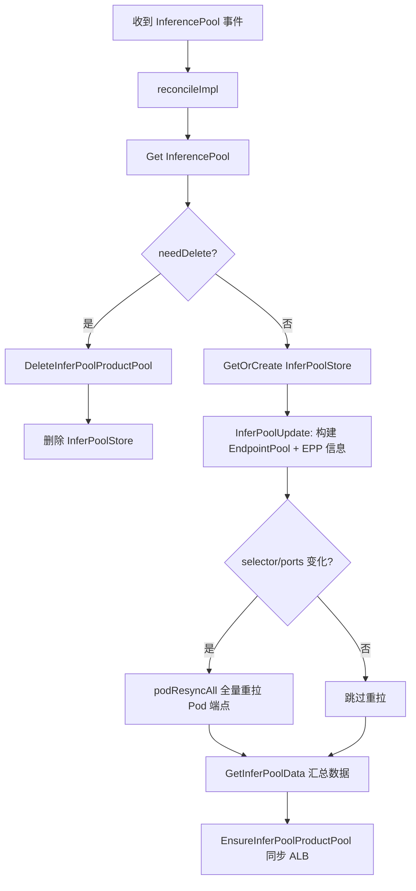
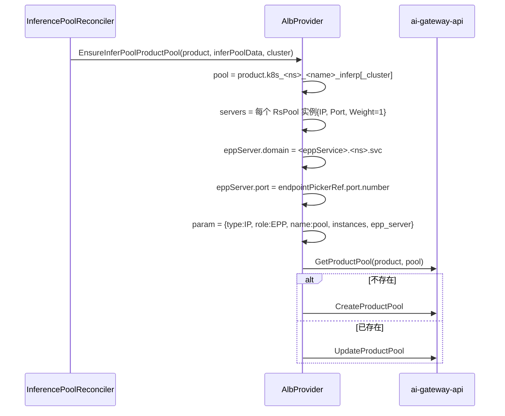
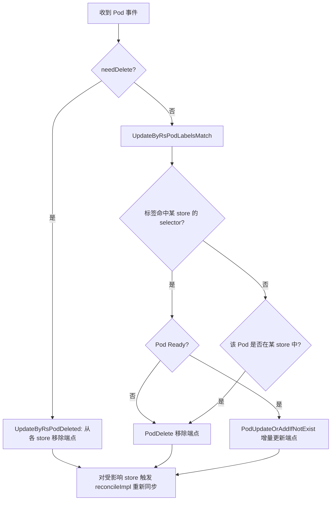
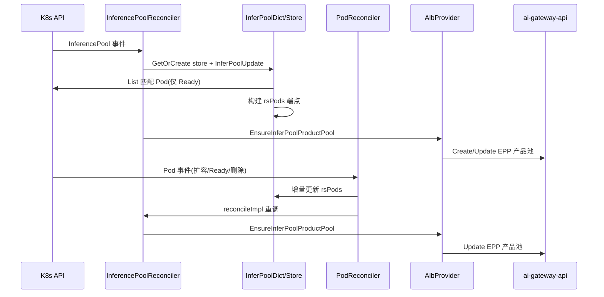

# K8s InferencePool 发现设计文档

本文档描述 ai-gateway-controller 的「InferencePool 发现」子系统的详细设计。

核心代码：
- `internal/controllers/loadbalancer/inferencepool_reconciler.go`
- `internal/controllers/loadbalancer/pod_reconciler.go`
- `internal/datastore/datastore.go`
- `internal/datalayer/datalayer.go`
- `internal/poolutil/poolutil.go`

## 1. 目标

监听 `inference.networking.k8s.io/v1` 的 `InferencePool` 资源，根据其 `selector` 选出后端推理 Pod、结合 `endpointPickerRef` 指向的 EPP Service，向 ai-gateway-api 同步一个 EPP 类型产品实例池，并在 Pod 动态变化时实时更新池内实例。

## 2. 整体结构

InferencePool 发现由两个控制器 + 一个内存数据存储协同完成：

| 组件 | 职责 |
| --- | --- |
| `InferencePoolReconciler` | 监听 InferencePool，维护 `InferPoolStore`，向 ALB 同步 EPP 产品池 |
| `PodReconciler` | 监听 Pod，按标签匹配推理端点，增量更新 `InferPoolStore` 并触发重调 |
| `InferPoolDict` / `InferPoolStore` | 内存中维护 InferencePool → 端点的映射，是两者交互的枢纽 |

## 3. 资源监听与过滤

- InferencePool：`For(&inferenceApi.InferencePool{}, builder.WithPredicates(filter.NamespaceFilter(), filter.EppXLabelFilter()))`（`inferencepool_reconciler.go:133`）。
- Pod：`For(&corev1.Pod{}).WithEventFilter(filter)`，filter 依据 Pod 标签是否命中任一 InferencePool 的 selector（`pod_reconciler.go:132`）。

过滤逻辑：

- `NamespaceFilter`：InferencePool 必须在监听命名空间内。
- `EppXLabelFilter`：恒返回 `true`（`filter/label.go:92`），即 InferencePool 无额外标签要求。
- Pod 过滤：`RsPodLabelsMatch` 判断 Pod 标签是否命中某 InferencePool 的 `selector`。

## 4. 核心数据结构

### 4.1 数据层（datalayer）

```go
type EndpointPool struct {
    Namespace   string            // inference pool 命名空间
    Name        string            // inference pool 名称
    Selector    map[string]string // 后端 Pod 标签选择器
    TargetPorts []int             // 目标端口列表
}

type EndpointMetadata struct {
    PodName string
    PodNs   string
    Address string  // pod.status.podIP
    Port    int     // 目标端口
    Labels  map[string]string
}
```

### 4.2 数据存储（datastore）

```go
type InferPoolStore struct {
    InferPoolName string
    InferPoolNs   string
    k8sServiceName string  // EPP Service 名(endpointPickerRef.name)
    k8sServicePort int32   // EPP Service 端口(endpointPickerRef.port.number)
    rsPool *datalayer.EndpointPool  // 推理端点池
    rsPods *sync.Map                // key: podName-rank-idx, value: Endpoint
    eppPool []*InferPoolEPP         // EPP 实例(预留)
}

type InferPoolData struct {
    InferPoolName string
    InferPoolNs   string
    EppEntry LLMPooEPPServiceEntry   // EPP Service 信息
    RsPool   []*InferPoolRS          // 推理实例
    EppPool  []*InferPoolEPP
}

type InferPoolDict struct {          // 全局内存字典
    inferPoolDict map[string]*InferPoolStore // key: ns_name
}
```

## 5. InferencePool Reconcile 主流程



代码见 `reconcileImpl`（`inferencepool_reconciler.go:83`）。

### 5.1 InferPoolUpdate

`datastore.go:149`：

1. 调用 `poolutil.InferencePoolToEndpointPool` 将 spec 转为 `EndpointPool`：
   - `Selector` = `spec.selector.matchLabels`；
   - `TargetPorts` = `spec.targetPorts[].number`；
   - `Namespace`/`Name` = InferencePool 的命名空间/名称。
2. 读取 `spec.endpointPickerRef`：
   - `k8sServiceName` = `endpointPickerRef.name`；
   - `k8sServicePort` = `endpointPickerRef.port.number`。
3. 若 selector 或 targetPorts 发生变化，触发 `podResyncAll` 全量重同步。

### 5.2 podResyncAll

`datastore.go:323`：

1. 清空 `rsPods`；
2. 按 selector 在 InferencePool 命名空间内 `List` Pod；
3. 仅保留 `Ready` 的 Pod（`poolutil.IsPodReady`）；
4. 为每个 targetPort 生成一个 endpoint，命名空间内名称为 `pod.Name-rank-<idx>`，地址为 `pod.status.podIP`；
5. 移除不再匹配或不再 Ready 的旧端点。

### 5.3 GetInferPoolData

`datastore.go:378`：从 `InferPoolStore` 汇总出 `InferPoolData`：

- `RsPool`：每个端点生成 `{Hostname: podName:port, IP: podIP, Port}`；
- `EppEntry`：`ServiceName` = EPP Service 名，`Ns` = InferencePool 命名空间，`Port` = EPP 端口；
- `EppPool`：EPP 实例（当前实现预留为空）。

## 6. EPP 产品池同步（EnsureInferPoolProductPool）

`internal/alb/albProvider.go:171`：



要点：

- 池名固定端口段为 `inferp`；
- 池 `type=IP`、`role=EPP`；
- 实例来源为 `InferPoolData.RsPool`，即匹配 selector 的 Ready Pod 的 `podIP:targetPort`；
- EPP Server：`domain = <endpointPickerRef.name>.<ns>.svc`，`port = endpointPickerRef.port.number`。

## 7. 删除流程（DeleteInferPoolProductPool）

`albProvider.go:242`：

1. 计算池名；
2. `ListProductPool` 拉取产品下全部池；
3. 匹配到目标池后调用 `DeleteProductPool` 删除。

同时 `reconcileImpl` 中从 `InferPoolDict` 删除对应 `InferPoolStore`（`inferencepool_reconciler.go:112`）。

## 8. Pod 增量同步（PodReconciler）



代码见 `pod_reconciler.go:58`。核心逻辑：

- 通过 `InferPoolDict.UpdateByRsPodLabelsMatch` / `UpdateByRsPodDeleted` 找到受影响的 `InferPoolStore`；
- 增量更新各 store 的 `rsPods`；
- 对每个受影响的 store 调用 `inferPoolReconciler.reconcileImpl` 重新同步 ALB。

## 9. 并发控制

- `InferencePoolReconciler.reconcileImpl` 使用 `sync.Mutex`（`c.mu`）串行化对数据存储与 ALB 的访问；
- `InferPoolDict` 与 `InferPoolStore` 内部均使用各自的锁保护 map 访问；
- `rsPods` 使用 `sync.Map`。

## 10. 端到端时序


