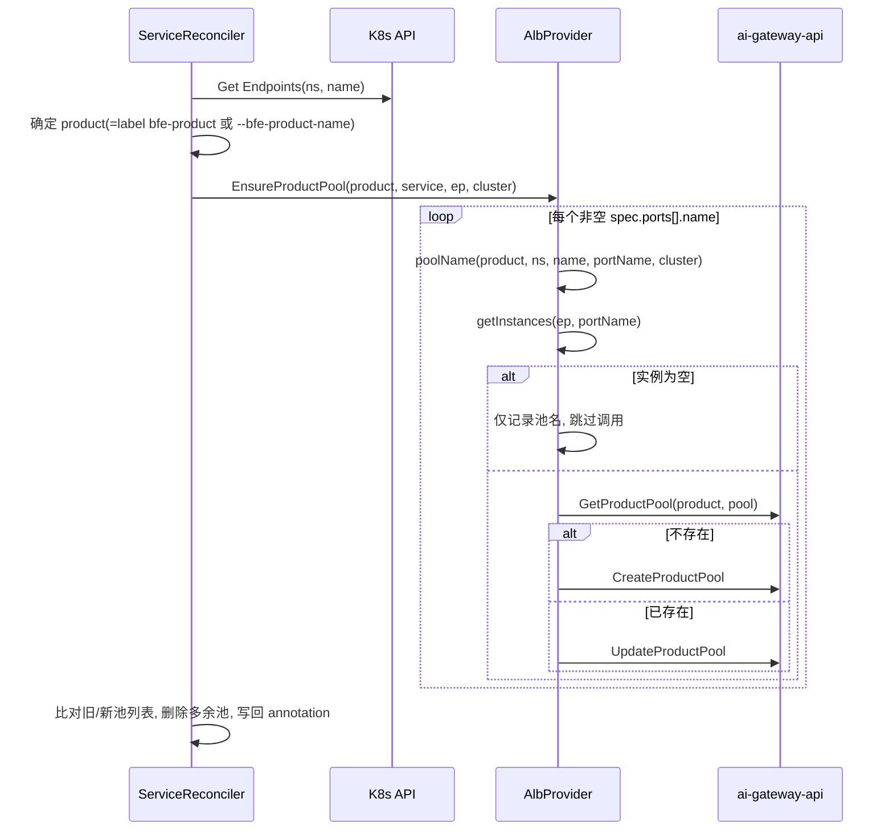

# K8s Service 发现设计文档

本文档描述 ai-gateway-controller 的「普通 AI K8s Service 发现」子系统的详细设计。

核心代码：`internal/controllers/loadbalancer/service_controller.go`

## 1. 目标

监听集群内普通 `Service`（及其同名 `Endpoints`），将携带 `bfe-product` 标签且属于监听命名空间的 Service 自动注册到 ai-gateway-api 的产品实例池中，并保证在 Service 变更/删除时同步更新或清理产品池。

## 2. 资源监听与过滤

控制器通过 `SetupWithManager` 注册对两类资源的监听（`service_controller.go:361`）：

- `For(&corev1.Service{}, ...)`：主资源。
- `Watches(&corev1.Endpoints{}, ...)`：当 Endpoints 变化时，将同名 Service 入队（`handler.EnqueueRequestForObject`）。

两者均应用以下两个 Predicate：

### 2.1 命名空间过滤（NamespaceFilter）

见 `internal/controllers/filter/namespace.go`。Service 的 `metadata.namespace` 必须属于启动参数 `--namespace` 指定的列表（默认 `*` 即所有命名空间）。

### 2.2 标签过滤（LabelFilter）

见 `internal/controllers/filter/label.go` 的 `isYingfeiRSService`：

- 要求功能开关 `--enable-rs-pool=true`；
- Service 必须携带标签 `bfe-product`，且其值必须与 `--bfe-product-name` 一致。

不满足条件的 Service 会被 Predicate 直接过滤掉，不触发 Reconcile。

## 3. 核心数据结构

```go
// 产品池标识（用于结果 annotation 与删除比对）
type ProductPoolname struct {
    Product  string
    Poolname string
}
type ProductPoolnameList []ProductPoolname

// ServiceReconciler
type ServiceReconciler struct {
    ExternalLB *openapi.AlbProvider
    client.Client
    Scheme   *runtime.Scheme
    recorder record.EventRecorder
}
```

关键常量（`service_controller.go:53`）：

```go
FinalizerName                  = "k8s.bfenetworks.com/delete-protection"
BfenetworksAnnotationPrefix    = "k8s.bfenetworks.com/"
ProductPoolResultAnnotationKey = "k8s.bfenetworks.com/productpool-result"
```

## 4. Reconcile 主流程


代码见 `Reconcile`（`service_controller.go:86`）。

### 4.1 needDelete 判定

`reconciler_common.go:75`：对象不存在（NotFound）或 `DeletionTimestamp` 非零时判定为删除。

### 4.2 finalizer 机制

- 首次处理 Service 时先添加 finalizer `k8s.bfenetworks.com/delete-protection`，防止 Service 被直接删除而遗漏产品池清理；
- 删除时先删除产品池，成功（或 `--force-rm-finalizer=true`）后移除 finalizer。

## 5. 产品池创建/更新（ensurePool）



`ensurePool`（`service_controller.go:138`）与 `ensureProductPool`（`service_controller.go:161`）要点：

1. 读取同名 `Endpoints`；
2. 确定 product：优先取 Service 标签 `bfe-product` 的值，否则取 `--bfe-product-name`；
3. 调用 `EnsureProductPool`（`internal/alb/albProvider.go:95`）逐个端口同步；
4. 结果与旧 annotation 中的池列表做 diff，删除已不再存在的池，并把最终列表写回 annotation。

### 5.1 实例提取（getInstances）

`albProvider.go:72`：遍历 `Endpoints.subsets[]`，取 `subset.ports[]` 中 `name == service端口名` 的端口，将 `subset.addresses[].ip` 作为实例：

```go
Instance{
    Hostname: addr.IP,
    IP:       addr.IP,
    Weight:   1,
    Ports:    map[string]int{"Default": int(p.Port)},
}
```

注意：只使用 `addresses`（Ready 地址），忽略 `notReadyAddresses`。

### 5.2 池命名

`albProvider.go:164`：

```
<product>.k8s_<namespace>_<service-name>_<port-name>[_<cluster-name>]
```

`<cluster-name>` 为空时不追加该段。

## 6. 池列表差异计算与 annotation

`ensureProductPool` 中维护 `k8s.bfenetworks.com/productpool-result` annotation，用于记录该 Service 当前管理的产品池列表（JSON 数组，元素为 `{Product, Poolname}`）：

- `genProductPoolNameList`：将本次生成的池名列表包装成 `ProductPoolnameList`；
- `extractPoolList`：反序列化旧 annotation；
- `diffList`：计算旧列表中已不在新列表的池（`diffList(old, new)`）；
- 对 diff 结果调用 `DeleteProductPoolByList` 删除多余池；
- `addAnnotationByList`：把最终列表写回 annotation。

这样即使 Service 的端口被删除/改名，也能清理对应的旧产品池。

## 7. 删除流程（deletePool）

`service_controller.go:189`：从 annotation `productpool-result` 读出池列表，逐个调用 `DeleteProductPoolByList` 删除产品池；成功后（或 `--force-rm-finalizer`）移除 finalizer。

## 8. 结果回写（result ConfigMap）

`handleResultConfigmap`（`service_controller.go:300`）将每次处理结果写入同名 `<service-name>.result` 的 ConfigMap：

| 字段 | 说明 |
| --- | --- |
| `labels["bfe-cm-result"]` | 固定 `yes` |
| `labels["bfe-result-type"]` | 固定 `service` |
| `labels["extra-msg"]` | 操作类型：`update` / `delete` |
| `data["result"]` | 成功为 `Succ`，失败为错误信息 |
| `data["timestamp"]` | 处理时间戳 |

删除成功时删除该 ConfigMap；其余情况创建或更新。

## 9. 事件与日志

`emitEvent`（`service_controller.go:348`）：成功记录 `Normal` 事件，失败记录 `Warning` 事件，事件 reason 形如 `update success For <ns>::<name>` / `update failed For <ns>::<name>`。

## 10. 错误重试

`Reconcile` 末尾：当处理出错且 `--retry-interval-unit-sec > 0`（代码中默认经 `option.SetOptions` 后实际生效值见 `internal/option/options.go:111` 默认 15s）时，返回 `RequeueAfter` 延迟重试。
