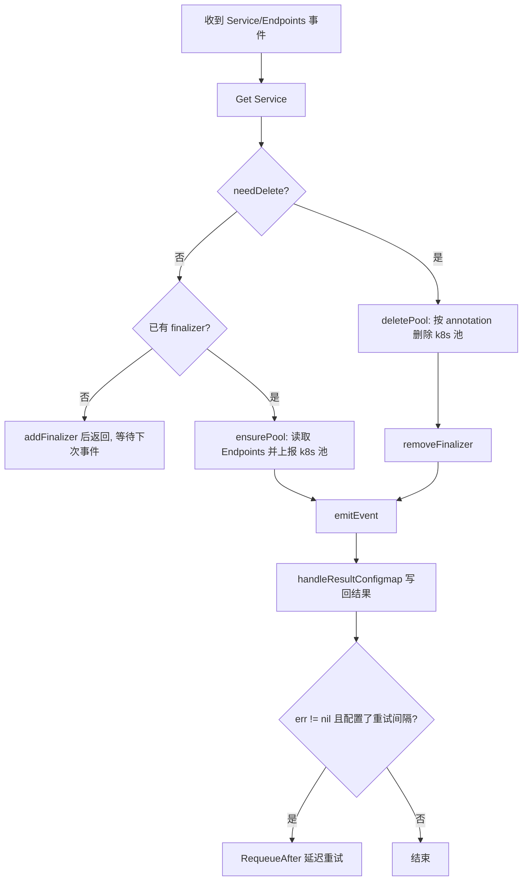
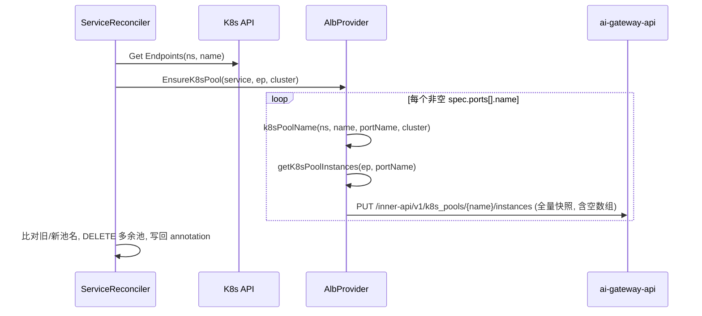

# K8s Service 发现设计文档

本文档描述 ai-gateway-controller 的「普通 AI K8s Service 发现」子系统的详细设计。

核心代码：`internal/controllers/loadbalancer/service_controller.go`

## 1. 目标

监听集群内普通 `Service`（及其同名 `Endpoints`），将携带 `ai-gateway-api-name` 标签且属于监听命名空间的 Service 所对应的后端实例，经 InnerAPI 全量上报到 ai-gateway-api 的 K8s 实例池（`k8s_pools`）；引用该池的 Provider 由 api 侧 fan-out 同步。Service 变更/删除时同步更新或清理池。

## 2. 资源监听与过滤

控制器通过 `setupWithManager` 注册对两类资源的监听（`service_controller.go:343`）：

- `For(&corev1.Service{}, ...)`：主资源。
- `Watches(&corev1.Endpoints{}, ...)`：当 Endpoints 变化时，将同名 Service 入队（`handler.EnqueueRequestForObject`）。

两者均应用以下两个 Predicate：

### 2.1 命名空间过滤（NamespaceFilter）

见 `internal/controllers/filter/namespace.go`。Service 的 `metadata.namespace` 必须属于启动参数 `--namespace` 指定的列表（默认 `*` 即所有命名空间）。

### 2.2 标签过滤（LabelFilter）

见 `internal/controllers/filter/label.go` 的 `isYingfeiRSService`（标签键常量为 `filter.RainwayAIGatewayAPIName = "ai-gateway-api-name"`，`label.go:40`）：

- Service 必须携带标签 `ai-gateway-api-name`，且其值必须与 `--ai-gateway-api-name` 一致（`--ai-gateway-api-name=*` 表示匹配任意带该标签的 Service）。

不满足条件的 Service 会被 Predicate 直接过滤掉，不触发 Reconcile。

## 3. 核心数据结构

```go
// ServiceReconciler
type ServiceReconciler struct {
    // AlbProvider 内含 InnerApiClient（k8s_pools InnerAPI）
    ExternalLB *openapi.AlbProvider
    client.Client
    Scheme   *runtime.Scheme
    recorder record.EventRecorder
}

// AlbProvider（internal/alb/albProvider.go:45）
type AlbProvider struct {
    options     *externalLB.Options
    innerClient K8sPoolClient // k8s_pools 通道，可注入 fake 便于单测
}
```

关键常量（`service_controller.go:53`，前缀常量定义于 `filter/label.go:39`）：

```go
RainwayAIGatewayAnnotationPrefix = filter.RainwayAIGatewayAnnotationPrefix // "k8s.bfenetworks.com/"
FinalizerName                    = RainwayAIGatewayAnnotationPrefix + "delete-protection"
K8sPoolResultAnnotationKey       = RainwayAIGatewayAnnotationPrefix + "k8spool-result"
```

## 4. Reconcile 主流程



代码见 `Reconcile`（`service_controller.go:86`）。

### 4.1 needDelete 判定

`reconciler_common.go:75`：对象不存在（NotFound）或 `DeletionTimestamp` 非零时判定为删除。

### 4.2 finalizer 机制

- 首次处理 Service 时先添加 finalizer `k8s.bfenetworks.com/delete-protection`，添加成功即返回，等待下次事件；添加失败则 `RequeueAfter 30s` 重试；
- 删除时先删除 k8s 池，成功（或 `--force-rm-finalizer=true`）后移除 finalizer，Service 才真正被删除；
- 删除事件到达但对象已消失（`Get` 返回 NotFound，例如 finalizer 曾被手动清理）时，在 `--skip-nil-svc-delete=true`（默认）下直接跳过。

## 5. K8s 池上报（ensurePool）



`ensurePool`（`service_controller.go:137`）与 `ensureK8sPool`（`service_controller.go:152`）要点：

1. 读取同名 `Endpoints`；
2. 调用 `EnsureK8sPool`（`internal/alb/albProvider.go:95`）逐个端口全量上报实例快照（空实例上报 `[]`，表达零实例），返回成功上报的池名列表；
3. 结果与旧 annotation 中的池名列表做 diff，删除已不再产生的池，并把最终列表写回 annotation（见 §6）。

### 5.1 实例提取（getK8sPoolInstances）

`getK8sPoolInstances`（`albProvider.go:65`）：遍历 `Endpoints.subsets[]`，对每个 subset 取第一个 `name == service端口名` 的端口，将 `subset.addresses[].ip` 作为实例，并按 `(addr, port)` 去重（命中端口后 `break` 出该 subset 的端口循环，继续处理其余 subset）：

```go
k8s_pool.Instance{
    Addr: addr.IP,
    Port: int(p.Port),
    // Weight 省略，由 API 置默认 100
}
```

注意：只使用 `addresses`（Ready 地址），忽略 `notReadyAddresses`。

### 5.2 池命名

`k8sPoolName`（`albProvider.go:152`）：

```
k8s_<namespace>_<service-name>_<port-name>[_<cluster-name>]
```

- `<cluster-name>` 为空时不追加该段；
- 超过 64 字符时折叠为可读前缀 + 8 位哈希：`pool[:55] + "_" + sha256("<ns>|<svc>|<port>|<cluster>")[:8]`（`shortHash8`，`albProvider.go:170`）；
- 结果统一经 `validK8sPoolName` 校验：1-64 字符，仅字母/数字/`_`/`-`/`.`，首尾不得为 `.`/`-`/`_`；不合法时返回错误，由 Reconcile 决定是否重试。

## 6. 池名差异计算与 annotation

`ensureK8sPool` 中维护 `k8s.bfenetworks.com/k8spool-result` annotation，用于记录该 Service 当前管理的 k8s 池名列表（JSON 字符串数组）：

- `extractPoolNames`：反序列化旧 annotation 为 `[]string`；
- `diffPoolNames`：计算旧列表中已不在新列表的池（`diffPoolNames(old, new)`）；
- 仅当本次 `EnsureK8sPool` 成功（`err1 == nil`）时，才对 diff 结果调用 `DeleteK8sPoolByList` 删除多余池；
- `DeleteK8sPoolByList` 返回真正删除成功的池名；未删成功的池由 `diffPoolNames(diff, delnames)` 保留下来，`append` 回最终列表，等待下次 reconcile 重试；
- `addAnnotationByPoolNames`：把最终列表写回 annotation。

这样即使 Service 的端口被删除/改名，也能清理对应的旧 k8s 池；删除失败的池不丢账，重试时继续处理。

## 7. 删除流程（deletePool）

`deletePool`（`service_controller.go:180`）：从 annotation `k8spool-result` 读出池名列表，逐个调用 `DeleteK8sPoolByList` 删除 k8s 池（404 视为成功）；删除成功（或 `--force-rm-finalizer`）后移除 finalizer `k8s.bfenetworks.com/delete-protection`。

## 8. 结果回写（result ConfigMap）

`handleResultConfigmap`（`service_controller.go:282`）将每次处理结果写入同名 `<service-name>.result` 的 ConfigMap：

| 字段 | 说明 |
| --- | --- |
| `labels["bfe-cm-result"]` | 固定 `yes` |
| `labels["bfe-result-type"]` | 固定 `service` |
| `labels["extra-msg"]` | 操作类型：`update` / `delete` |
| `data["result"]` | 成功为 `Succ`，失败为错误信息 |
| `data["timestamp"]` | 处理时间戳 |

删除成功时删除该 ConfigMap；其余情况创建或更新。

## 9. 事件与日志

`emitEvent`（`service_controller.go:330`）：成功记录 `Normal` 事件，失败记录 `Warning` 事件，事件 reason 形如 `update success For <ns>::<name>` / `update failed For <ns>::<name>`。

## 10. 错误重试

`Reconcile` 末尾（`service_controller.go:127`）：当处理出错且 `--retry-interval-unit-sec > 0` 时，返回 `RequeueAfter` 延迟重试。注意该 flag 在 `cmd/ai-gateway-controller/flags.go:59` 的默认值为 `-1`（不重试），会覆盖 `internal/option/options.go:100` 的内置初值 `15`，因此只有显式传入正值才会启用延迟重试。
